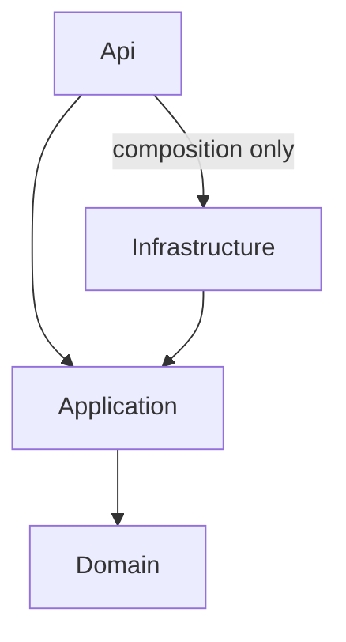

# InviteMe backend

Milestone 1: a .NET 10 modular monolith with vertical slices, PostgreSQL/EF Core 10, Identity, JWT validation, SignalR, and two test projects. One business-independent slice is implemented: `GET /api/health/application`.

**Scope:** EF now maps all 37 v2 business tables, four Identity support tables and three reporting views. Wedding Guest, RSVP, seating, check-in, gift, notification, audit, templates and subscription records are persistence models with private setters; workflow mutations and APIs remain future work. Seating tables/assignments use version concurrency tokens advanced by EF SaveChanges. Registration/login/token issuance, capacity locking, delivery workers and business endpoints are still pending. No migration runs automatically at API startup.

## Architecture



| Project | Responsibility |
| --- | --- |
| Api | Endpoints, authentication validation, HTTP errors, SignalR hub, OpenAPI, composition |
| Application | Use-case handlers, DTOs, validators, authorization orchestration and infrastructure contracts |
| Domain | Business types and invariants; no EF Core, HTTP or project dependencies |
| Infrastructure | PostgreSQL, EF mappings, Identity stores, external adapters when required |
| UnitTests | Isolated permission, validation and token behavior |
| IntegrationTests | Actual ASP.NET pipeline and opt-in PostgreSQL Testcontainers |

Application owns provider-independent contracts in `Ports/`. Infrastructure implements persistence ports in `Persistence/Adapters/` using EF Core/Npgsql; API supplies the request-scoped current-user port and wires dependencies at the composition root. Application and Domain must not reference EF Core, Npgsql, Infrastructure or provider SDKs. Future persisted slices introduce use-case-specific ports such as `IRsvpStore`; expose domain data/application results, never DbContext, DbSet, IQueryable or SDK types. Introduce transaction/outbox ports only with an implementing workflow. Do not introduce generic repositories or a service/manager/unit-of-work chain.

The supplied Review 1 architecture diagram is the structural reference; see [component alignment](docs/architecture-diagram-alignment.md) for implemented and planned components. Frontend deployment, external adapters, background processing and AWS deployment are still planned capabilities.

See [full source tree](docs/solution-tree.md), [architecture and module ownership](docs/architecture.md), and [database baseline decisions](docs/database.md).

## Prerequisites and startup

Install the .NET 10 SDK and Docker with a running engine. `global.json` permits newer .NET 10 feature bands. The workspace-local SDK used during initialization is ignored by Git. To use it in PowerShell:

```powershell
$env:DOTNET_ROOT = Join-Path $PWD '.dotnet'
$env:PATH = "$env:DOTNET_ROOT;$env:PATH"
```

1. Copy `.env.example` to `.env`. Set a local database password and a fresh base64 signing key.
2. Start PostgreSQL: `docker compose up -d postgres`.
3. Set API configuration using the environment or user secrets. Compose's `.env` is **not** automatically loaded by `dotnet run`.

```powershell
# Generate a signing key in memory; do not put real values in source control.
$env:Jwt__SigningKey = [Convert]::ToBase64String([Security.Cryptography.RandomNumberGenerator]::GetBytes(32))
$env:ConnectionStrings__PostgreSQL = 'Host=localhost;Port=5432;Database=inviteme;Username=inviteme;Password=<same-local-password>'
dotnet restore InviteMe.sln
dotnet build InviteMe.sln --no-restore
dotnet dev-certs https --trust
dotnet run --project src/InviteMe.Api --launch-profile https
```

Development endpoints:

- API: `https://localhost:7043/api/health/application`
- Swagger UI: `https://localhost:7043/swagger`
- OpenAPI: `https://localhost:7043/openapi/v1.json`
- Liveness: `/health`, `/health/live`
- PostgreSQL connectivity readiness: `/health/ready`
- Protected SignalR: `/hubs/weddings`

Readiness only checks connectivity, not schema readiness; no usable business database is implied. Liveness works without a database connection, but startup requires valid configuration.

Optional local containers: `docker compose --profile app up --build -d` serves HTTP on loopback port 5043. This profile deliberately uses Development for local Swagger access. Production uses the Dockerfile with Production configuration and HTTPS termination. Configure trusted proxy forwarding before relying on forwarded scheme/client-IP headers; never trust arbitrary forwarded headers. The runtime container runs as the built-in non-root user.

## Configuration

| Variable | Purpose |
| --- | --- |
| `ConnectionStrings__PostgreSQL` | PostgreSQL connection string; required |
| `Jwt__Issuer` | Expected token issuer; default InviteMe |
| `Jwt__Audience` | Expected audience; default InviteMe.Web |
| `Jwt__SigningKey` | Required base64 random key, at least 32 bytes |
| `Jwt__ExpirationMinutes` | Future issuing lifetime, 1–60; default 15 |
| `Frontend__Url` | Exact HTTP(S) origin for CORS; default http://localhost:5173 |
| `AllowedHosts` | Deployment hostname allowlist; default localhost |
| `ASPNETCORE_ENVIRONMENT` | Development enables documentation; use Production when deployed |
| `POSTGRES_PASSWORD` | Compose-only database password |
| `JWT_SIGNING_KEY` | Compose-only source for Jwt__SigningKey |
| `INVITEME_TEST_POSTGRES` | Set to 1 to enable Docker-backed tests |
| `INVITEME_TEST_CONNECTION_STRING` | Optional disposable PostgreSQL connection for the database test |

`appsettings.example.json` is a reference, not an automatically loaded configuration file. Email, SMS, Storage and AI provider settings will be added when their adapters are introduced.

## Authentication and authorization

Identity registers UUID users and roles with its password hasher, a 12-character minimum, and a five-attempt lockout policy. Future login must use Identity's lockout-aware flow; registering these options alone does not implement login.

JWT validation requires HS256, a valid signature, issuer, audience, expiry, and a non-empty UUID `sub`. Role claims use `role`; platform roles are only `ADMIN` and `USER`. The `PlatformAdmin` policy is registered. All endpoints require authentication by default unless explicitly anonymous.

Milestone 2 will implement register/login/current-user using Identity, rate limiting, and JWT issuance. `ExpirationMinutes` is reserved for issuance; it does not shorten externally issued tokens. Proposed logout: discard short-lived access tokens locally. Access tokens remain valid until expiry; Identity security-stamp changes do not automatically revoke bearer JWTs. Decide whether persistent rotating, hashed refresh tokens and immediate revocation are needed before adding their schema.

Wedding authorization uses `IWeddingPermissionService.RequireAsync(weddingId, permission, cancellationToken)`. It obtains the actor from the authenticated context and `WeddingAccessReader` performs a read-only query scoped by wedding and user. An `ACTIVE` user is allowed as owner or as an `ACTIVE` co-host with an explicit wedding-scoped permission. ADMIN is not an implicit wedding-data bypass. Missing weddings and denied access both produce 403 to avoid revealing existence.

Guests will use cryptographically random invitation tokens, storing only SHA-256 hashes. The hashing helper is implemented; invitation endpoints and persistence are not. Guests, reception staff and AI are not additional platform roles.

## Errors, validation and logging

Central exception handling returns ProblemDetails with `code` and `traceId`. Validation uses 400 and field-level `errors`; authentication 401; authorization 403; not found 404; concurrency/unique conflicts 409; business-rule failures 422; unexpected failures 500. Responses never contain stack traces, SQL or internal exception messages.

A slice with input explicitly invokes `RequestValidation<T>.ValidateAsync` before work. FluentValidation validators are discovered through assembly scanning. The no-input health slice needs no validator. Domain invariants and database constraints supplement request validation. `PageRequestValidator` enforces page sizes 1–100; handlers must validate before querying. `PagedResult<T>` returns direct pagination metadata.

JSON console logs include a server-generated correlation scope and response header `X-Correlation-ID`. HTTP hosting and EF logs default to Warning to avoid routine URLs/query tokens and SQL. The central handler logs only exception type and correlation ID. Add UserId/WeddingId/GuestId scopes when the corresponding workflows exist. Do not log raw tokens, passwords, personal payloads or payment bodies. Configure reverse proxies to redact query strings as well.

## Database migrations

See [database.md](docs/database.md) before running these commands. Four migrations are checked in: the frozen v1 `ExistingSchemaBaseline`, additive `AddIdentitySupport`, `AlignBusinessSchemaV2`, and the metadata-only `AdoptV2EntityMappings`. The last migration records existing tables/views in the EF snapshot without creating them again. A fresh database finishes on schema v2 plus Identity and legacy gift provenance. The authoritative v2 source is `Persistence/Schema/BaselineV2.sql`; historical migrations remain unchanged.

After reconciliation and review:

```powershell
dotnet tool restore
dotnet ef migrations script --idempotent --project src/InviteMe.Infrastructure --startup-project src/InviteMe.Api --output artifacts/migrations.sql
dotnet ef database update --project src/InviteMe.Infrastructure --startup-project src/InviteMe.Api
```

Create the `artifacts` directory before requesting the script output. The design-time factory only needs `ConnectionStrings__PostgreSQL`; it does not require JWT configuration or a live connection for script generation. Review SQL before applying it. For externally installed v1 use `MarkExistingBaseline.sql`; for externally installed v2 use `MarkExistingV2.sql`, after comparing the entire live schema with its reference. Databases with valid EF history apply only pending migrations. Follow `docs/database.md` for preflight failures and data conversion. Production migrations are a separate deployment step. Never call `EnsureCreated` in application startup or delete existing data to repair a migration.

## Transactions, concurrency and realtime

The detailed contracts are in [architecture.md](docs/architecture.md). A single PostgreSQL transaction covers each multi-record operation. Capacity updates lock the wedding row **before** counting participants; seating updates lock affected tables in deterministic UUID order, count occupancy, and compare expected versions. Every writer that changes those counts follows the same lock protocol. Optimistic conflict yields 409; database uniqueness remains the final protection for check-in and gift idempotency.

SignalR is notification-only. Join requires `WEDDING_VIEW` through the permission service; the owner passes, co-hosts require an explicit grant. Groups use `wedding:{uuid}`. Tokens in query strings are accepted only for WebSocket/SSE requests to the hub path. Connections close at token expiration. No business broadcasting exists yet. Future events must follow commit and carry only invalidation/version data; sensitive gifts/check-in data must be fetched through permission-checked HTTP endpoints. Add membership-revocation handling before enabling persistent group broadcasts. See the [Microsoft SignalR security guidance](https://learn.microsoft.com/en-us/aspnet/core/signalr/authn-and-authz?view=aspnetcore-10.0).

## Tests

```powershell
dotnet test InviteMe.sln
# With Docker running:
$env:INVITEME_TEST_POSTGRES = '1'
dotnet test tests/InviteMe.IntegrationTests --filter Category=PostgreSQL
```

You may instead set `INVITEME_TEST_CONNECTION_STRING` to a disposable PostgreSQL database. The database test applies migrations and writes fixtures; never use a shared or production database.

Default tests cover permission isolation, model mapping, validation bounds, token hashing, liveness/readiness, OpenAPI, ProblemDetails, JWT validation and hub authentication. The opt-in PostgreSQL test uses a disposable database, executes `MigrateAsync`, seeds owner/co-host/revoked-member cases, and exercises the real `WeddingAccessReader`.

Business concurrency tests are milestone acceptance criteria, not simulated success in this foundation: RSVP 148/150 with two +2 requests; seating 9/10 with two inserts; stale version 5 after version 6 returns HTTP 409. Also add duplicate check-in/gift, invalid import, cross-wedding token scope, RSVP history and walk-in tests with their implementations.

## Packages

Versions are pinned centrally in `Directory.Packages.props`:

- ASP.NET Core JWT Bearer, Identity EF, OpenAPI and MVC Testing: 10.0.12
- EF Core Design and Microsoft DI abstractions: 10.0.12
- Npgsql EF Core provider: 10.0.3
- FluentValidation DI extensions: 12.1.1
- Swashbuckle Swagger UI: 10.2.3
- Microsoft.NET.Test.Sdk: 17.14.1
- xUnit: 2.9.3; Visual Studio runner: 3.1.5
- Testcontainers PostgreSQL: 4.15.0

Identity/EF dependencies bring EF Core transitively. SignalR, health checks and JSON logging use the ASP.NET shared framework. ClosedXML, CsvHelper and QRCoder are deferred until their slices need them. No mediator, broker, Redis or outbox is introduced. The provider supports EF Core 10; see [Npgsql release notes](https://www.npgsql.org/efcore/release-notes/10.0.html).

## Team conventions and next milestone

Use feature folders, PascalCase types/methods/properties, camelCase locals, nullable reference types, Async suffixes, and propagated cancellation tokens. Use UTC and TIMESTAMPTZ; store wedding timezone separately. Prefer TimeProvider for time-sensitive tests. Reads use AsNoTracking and DTO projections. Preserve history/audits; archive entities where business rules require it. Make schema enums/column names explicit rather than relying on CLR names.

**Next: Milestone 2 — Identity + Wedding.** Review and apply the additive Identity migration in an isolated database, then implement registration/login/current-user and minimal wedding ownership/membership endpoints.

Open decisions: whether legacy `password_hash` values were produced by ASP.NET Core Identity, registration/email-verification policy, refresh/revocation requirements, admin wedding-data access policy, deployment origin/proxy configuration, and reliable delivery requirements. Roles and wedding permissions are seeded by the supplied baseline.
