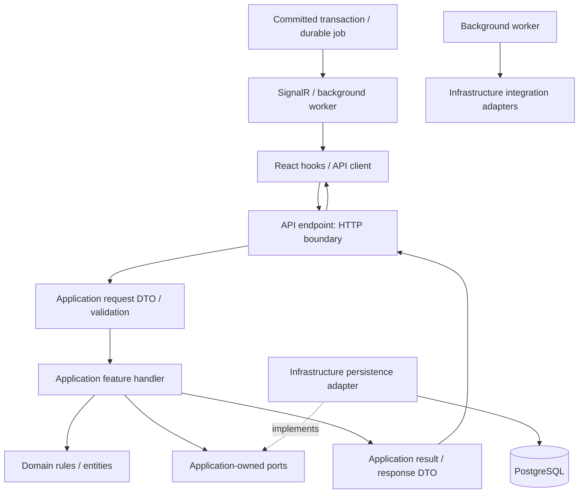

# Architecture diagram alignment

Structural reference: `D:/codei/InviteMe-Architecture Diagram.drawio (1).png`, InviteMe Detailed System Architecture / Review 1. This is a request/response design and target deployment view, not evidence that every box has been implemented.

## Boundaries and request flow

The API composition root can reference Infrastructure for DI. Endpoint code delegates to handlers and does not query EF or invoke provider SDKs. Application references Domain, owns ports and orchestrates rules/transactions; Infrastructure implements those ports. Domain has no dependency on API, Application, Infrastructure or persistence/provider frameworks. A port returns domain/application data rather than IQueryable, DbContext, DbSet or SDK models.

## Component mapping

| Diagram component | Repository location | Current status |
| --- | --- | --- |
| Endpoint/controller | Api/Endpoints | Health slice exists; business endpoints pending |
| Request DTO/validation | Application/Features + Common/Behaviors | Validation foundation exists; per-feature contracts pending |
| Use-case handler | Application/Features/{Module}/{UseCase} | Health handler exists; business handlers pending |
| Domain rules/entities | Domain/{Module} | Full v2 persistence models; workflow mutation rules pending |
| Application ports | Application/Ports/{Area} | Current-user/access contracts exist; feature-specific stores/transaction contracts added with workflows |
| Persistence adapter | Infrastructure/Persistence/Adapters | WeddingAccessReader implements IWeddingAccessReader; complete EF mappings behind Infrastructure |
| Integration adapters | Infrastructure feature adapters, added when implemented | Email/Zalo/AI/payment/storage adapters pending |
| SignalR hub | Api/Hubs/WeddingHub | Authorized groups exist; post-commit business broadcasts/revocation handling pending |
| Background worker | Hosted worker, introduced with persisted due jobs | Pending; no empty worker registered |
| PostgreSQL | Infrastructure/Persistence | Schema v2, Identity, migrations, table/version/check-in/gift constraints verified |
| Payments webhook slice | Api/Endpoints/Payments + Application/Features/Payments | Pending; signature validation/deduplication must precede processing |
| React/Vercel and S3 browser uploads | Separate frontend and deployment configuration | Not present in this backend repo |
| GitHub Actions → AWS | Deployment workflow when credentials/runtime are configured | Not configured in this repo |

## Consistency and integrations

RSVP orchestration performs capacity checks and writes under one transaction through persistence ports. Stores implement the agreed lock protocol; transaction handles are provider-neutral. Seating uses version checks and row locking; EF already advances tracked table/assignment versions and detects stale updates. Check-in/payment uniqueness is enforced by PostgreSQL and future use cases must handle duplicate requests explicitly.

SignalR publishes after commit and clients refetch after reconnect. Do not call providers inside a retryable database transaction. The diagram's worker/outbox flow requires persisted jobs and dispatch semantics before business delivery is enabled; the current schema has notification scheduling but no transactional outbox/job table. Add those with reviewed migrations and real workflows, rather than claiming durability from an in-memory queue.

Amazon SES, approved Zalo templates, configurable AI providers, SePay/mock payments, S3, Hangfire, EC2 and Nginx are proposed/configuration-dependent integrations. Provider credentials remain server-side, ports remain application-owned and provider-specific implementations stay in Infrastructure. No AWS deployment or provider installation is implied by an architecture refactor.

## Terminology and requirement precedence

The Review 1 picture still labels actors Guest and Reception Staff. Current business terminology/schema v2 uses Wedding Guest, separate GuestParticipant and WalkIn. Reception/check-in operations belong to authorized Wedding Co-hosts under the updated Report limitations. Follow the diagram's boundaries and request flow while retaining these updated business definitions; do not introduce a separate Reception Staff role merely to reproduce an older label.
